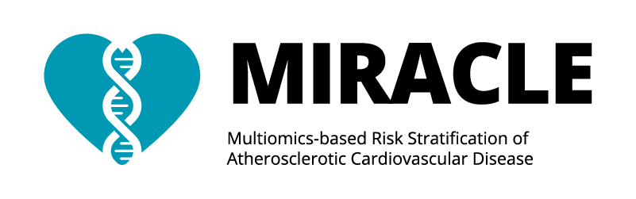
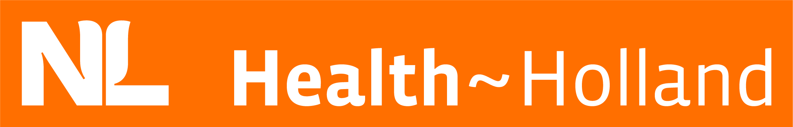
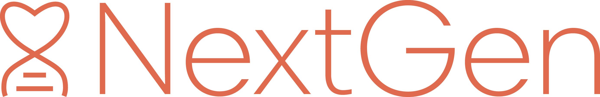
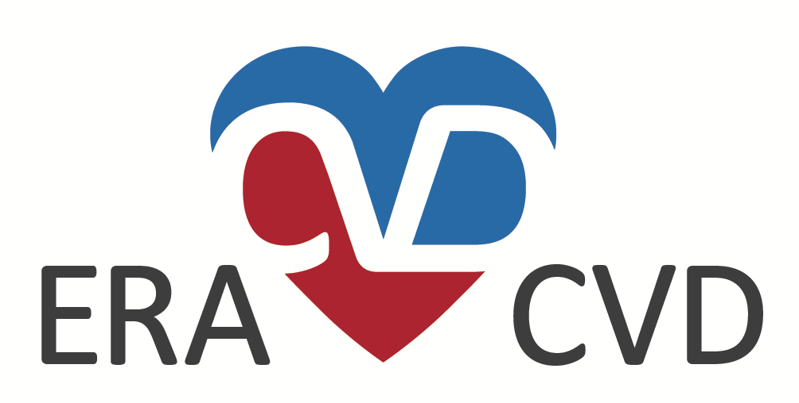
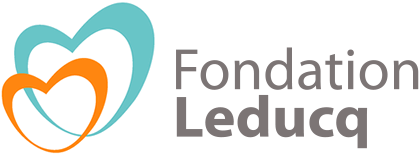
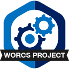
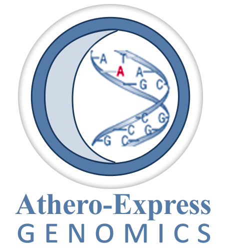

[MonopogenLite](https://github.com/swvanderlaan/MonopogenLite)
============
 

**MonopogenLite** _Germline SNV calling and phasing from single-cell sequencing data (for macOS Sequoia and Linux Rocky8)._

This is a fork of the original [`MonopogenLite`](https://github.com/KChen-lab/Monopogen) which works with python (3.9+), and `samtools` and `bcftools` (v1.21), `vcftools` (v0.1.16), and `tabix` (`htslib`, v1.21), as well as in the context of `Rocky8` (Linux) and macOS Sequoia with [`brew`](https://brew.sh). 

`MonopogenLite` was forked from `Monopogen` and edited as such to accommodate the work in [**MetaPlaq**](https://chanzuckerberg.com/science/programs-resources/cell-science/data-insights/metaplaq-integrative-single-cell-meta-analysis-for-atherosclerosis/). In **MetaPlaq** we meta-analyzed 140+ samples with single-cell RNA and ATAC sequencing data which have varying degrees of sequencing quality and depth. Many of these datasets are of limited use for reliable _de novo_ genotype calling. The main focus is on genetic ancestry inference and _cis_-acting expression quantitative trait loci (eQTL). 

`MonopogenLite` is a light-version of `Monopogen` and only includes the _germline calling_ and _phasing_ of single-nucleotide variants (SNVs) from single-cell sequencing data. 

It has a few improvements:

* ✅ Works cross-platform on macOS Sequoia and Linux Rocky8.
* ✅ Works with the newest versions of `bcftools`, `samtools`, `vcftools`, `tabix`, and `htslib`.
* ✅ Works with the version 4.1 of `BEAGLE` which still includes the `gl` option.
* ✅ Works with `python 3.9+`.
* ✅ Reproducible workflow to include a genome reference through [`refgenie`](http://refgenie.databio.org/en/latest/).
* ✅ Reproducible workflow to include 1000G phase 3 high-coverage b38 data including 3,202 individuals.
* ✅ Streamline code.
* ✅ Added `--debug`, `--logFile`, `--version` flags.
* ✅ Removed hard-coding of `--platform-library`; now works with _smartseq2_ and _celseq2_, aside of _10x_ data.
* ✅ Removed hard-coding of `--nthreads` for the phasing step executed through `BEAGLE`.
* ✅ Improved handling of per-sample or per-cell SNV calling and phasing.
* ✅ Added script to prepare outputs for TOPMed imputation.
* ✅ Code improved to only calls bi-allelic SNVs; no structural, INDELs or multi-allelic variants are called.
* ✅ Added handling of chromosome X - Phased haploid male samples in the phased imputation panel are now converted from "0" or "1" to "0|0" or "1|1", respectively.
* ✅ Refactored code to improve readability and maintainability, and cross-platform compatibility.
* ✅ Utilities work with regular `cpu` or `gpu`.
* ✅ Various utility-scrips:
  * ✅ `compare_vcf2ref.py` -- to compare a given VCF-file to a common reference VCF-file and list the non-overlapping variants.
  * ✅ `variant_ref_create.sh` -- create a reference VCF-file from a given set of BAM-files.
  * ✅ `variant_ref_checker.py` -- apply `bcftools stat` to calculate statistics on the newly generated reference file (including plotting). Including `variant_ref_checker_submit.sh` to submit the `variant_ref_checker.py` script to a job scheduler.
  * ✅ `makediploidmalesX.py` -- make haploid males diploid, or reverse male diploid genotypes to haploid on chromosome X in a given VCF-file. Including `makediploidmalesX_submit.sh` to submit the `makediploidmalesX.py` script to a job scheduler.
  * ✅ `cellsnp_vcf_merger.py` -- merge per-sample VCF files into 1 VCF per study. Including `cellsnp_vcf_merger_submit.sh` to submit the `cellsnp_vcf_merger.py` script to a job scheduler.

That said, `MonopogenLite` is just a light-weight version of `Monopogen`, originally developed by the [Ken Chen Lab](https://www.mdanderson.org/research/departments-labs-institutes/labs/ken-chen-laboratory.html) at the [MD Anderson Cancer Center](https://www.mdanderson.org/). All credit goes to the original authors and contributors of the concepts underlying `Monopogen`; we simply adapted and improved it in some functional and coding areas.

## 📣 Acknowledgements
Dr. Sander W. van der Laan is funded through EU H2020 TO_AITION (grant number: 848146), EU HORIZON NextGen (grant number: 101136962), EU HORIZON MIRACLE (grant number: 101115381), Health~Holland PPP Allowance ‘Getting the Perfect Image’, and CZI ['MetaPlaq'](https://chanzuckerberg.com/science/programs-resources/cell-science/data-insights/metaplaq-integrative-single-cell-meta-analysis-for-atherosclerosis/).

We are thankful for the support of the Leducq Fondation ‘PlaqOmics’ and 'AtheroGen'. The research for this contribution was made possible by the AI for Health working group of the [EWUU alliance](https://aiforhealth.ewuu.nl/). The collaborative project ‘Getting the Perfect Image’ was co-financed through use of PPP Allowance awarded by Health~Holland, Top Sector Life Sciences & Health, to stimulate public-private partnerships. Part of the work and data generation (scRNAseq and bulk RNAseq) were funded through ERA-CVD 'druggable-MI-targets' project (grantnumber: 01KL1802). 

Plaque samples are derived from carotid endarterectomies as part of the [Athero-Express Biobank Study](https://doi.org/10.1007/s10564-004-2304-6) which is an ongoing study in the UMC Utrecht.

### 📝 Disclosures
Dr. Sander W. van der Laan has received Roche funding for unrelated work.

        

#### 📦 Changes log
    
    _Version:_      v1.3.1 
    _Last update:_  2025-06-06 
    _Written by:_   Jinzhuang Dou | jdou1 [at] mdanderson [dot] org; Sander W. van der Laan | s.w.vanderlaan [at] gmail [dot] com.
    
    **MoSCoW To-Do List**
    The things we Must, Should, Could, and Would have given the time we have.
    _M_
    
    _S_
    
    _C_

    _W_
    - [ ] add the support for somatic SNV calling and LD refinement  

--------------

#### MIT License (MIT)
##### Copyright (c) 1979-2025 Sander W. van der Laan | s.w.vanderlaan [at] gmail [dot] com.
